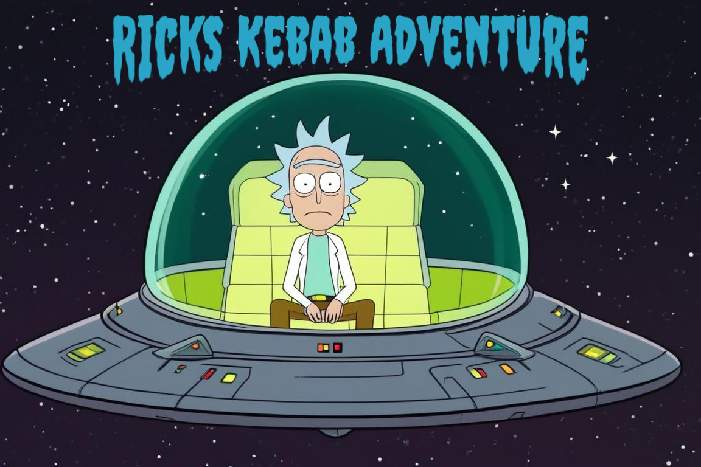
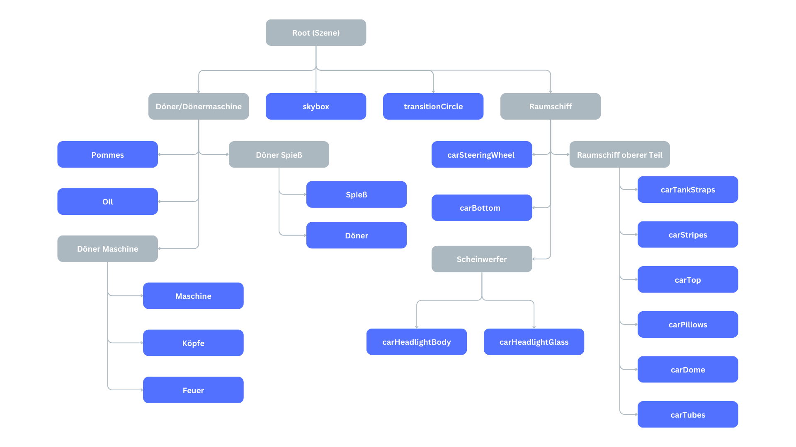

# Rick's Kebab Adventure - Ein interdimensionales OpenGL-Abenteuer


*Dieses Titelbild wurde mithilfe von Stable Diffusion XL generiert.*

## 🚀 Story

Rick, der geniale Wissenschaftler, hatte es satt, die langweiligen Döner seines Universums zu essen. Mit Entschlossenheit aktivierte er sein interdimensionales Raumschiff und begab sich auf eine Reise durch die Multiversen, um den leckersten Döner zu finden, den die Realität zu bieten hatte.
Von Dimension zu Dimension hüpfend, probierte Rick jeden Döner, den er finden konnte. Einige waren zu trocken, andere zu fettig, manche hatten seltsame Zutaten, die selbst Rick nicht identifizieren konnte. Doch er gab nicht auf.

## 👥 Teammitglieder

- [Daniel Japs](https://github.com/Daniel-Japs)
- [Julian Vottschel](https://github.com/Julianvott)
- [Mohammad Freej](https://github.com/Moka316)
- [Dario Kasumovic Carballeira](https://github.com/DarioElpapi)

## 📝 Erfüllte Anforderungen

### 1️⃣ SELBST RECHERCHIERTE ANFORDUNGEN
- ✅ Wassereffekte (Reflexion, Brechung) 
   Wassereffekte (Reflexion, Brechung):
   Diese Effekte werden hauptsächlich in den Funktionen renderReflectionTexture und renderRefrationTexture in der Datei scene.c umgesetzt. Dort werden Framebuffer für Reflexion und Brechung initialisiert und genutzt, um die Szene aus verschiedenen Blickwinkeln zu rendern und die Ergebnisse als Texturen zu verwenden.
- ✅ Fresnel-Effekt für Wasser
   Der Fresnel-Effekt für das Wasser wird im Fragment-Shader basic_fragment_shader.glsl verarbeitet. Die Berechnung erfolgt in der main()-Funktion dieses Shaders, wo der Betrachtungswinkel und die Reflexions- und Brechungstexturen gemischt werden, um den Effekt des Lichtbrechens an der Oberfläche des Wassers zu erzeugen.
- ✅ Spotlight
   Die Spotlight-Funktion wird im Fragment-Shader basic_fragment_shader.glsl implementiert. Die Berechnungen für die Beleuchtung unter Verwendung der Scheinwerferparameter (Position, Richtung, Cut-Off-Winkel) finden in der Funktion calcLight statt. Hier werden die Lichtquellen mit ihren Positionen, Richtungen und Farben berücksichtigt, um die Beleuchtung für jedes Fragment der Szene zu berechnen

### 2️⃣ ERWEITERTE ANFORDERUNGEN
- ✅ Import von Geometriedaten aus separaten Dateien
   Die Geometriedaten werden in den Dateien initScene() und den entsprechenden initObject()-Funktionen in der scene.c importiert. Jedes Objekt wird aus einer separaten .obj-Datei geladen und durch die entsprechenden Materialien und Texturen ergänzt. Dies geschieht für Objekte wie die Maschine, den Döner, die Pommes und die verschiedenen Teile des Raumschiffs
- ✅ sinnvolle Aufteilung des Codes auf mehrere Dateien (insb. Shader-Code in separaten
Dateien)
- ✅ Datentypen und Hilfsfunktionen für Shader, Geometriedaten, Texturen
   Die Dateien shader.c und texture.c enthalten Hilfsfunktionen für die Verwaltung von Shader-Programmen und Texturen.
   Die Struktur Object in der Datei scene.h und scene.c enthält Datenstrukturen für die Geometriedaten jedes Objekts.
- ✅ Überprüfung übergebener Funktionsparameter durch Assertions (soweit möglich)
   Assertions werden in verschiedenen Teilen des Codes verwendet, um sicherzustellen, dass Eingabeparameter korrekt sind. Zum Beispiel in den Matrixfunktionen, die in matrix.c definiert sind, werden Eingabeparameter auf Korrektheit geprüft.
- ✅ Tests für alle Matrixfunktionen
   Die Matrixfunktionen, die in matrix.c implementiert sind, beinhalten entsprechende Tests, um sicherzustellen, dass sie korrekt funktionieren. Diese Tests können in den entsprechenden Testdateien (matrix_test.c oder ähnlich) implementiert sein.
- ✅ Strukturierung der Szene durch einen einfachen Szenengraph
   Die Szene ist durch eine einfache Strukturierung in scene.c organisiert, wo verschiedene Objekte als Teil des Szenengraphen hinzugefügt und verwaltet werden. Dies umfasst auch die Animationen und die Initialisierung der Szene
- ✅ einfache Benutzerinteraktion mit Kamera und/oder Objekten (z. B. über Tastatur)
   Die Datei camera.c und camera.h enthält Funktionen zur Interaktion mit der Kamera, einschließlich der Steuerung über die Tastatur. Die Kameraposition und -orientierung können dynamisch aktualisiert werden.
- ✅ Beleuchtung der Szene mit mehr als einer Lichtquelle
   Die Datei light.c und light.h verwaltet die Beleuchtung in der Szene. Die Szene kann mehrere Lichtquellen haben, die in den Shadern entsprechend berücksichtigt werden
- ❌ gleichzeitige Verwendung von mindestens zwei Texturen in einem Objekt
- ✅ gleichzeitige Verwendung von mindestens zwei verschiedenen Shader-Programmen in einer Szene
   Die Implementierung erlaubt die Verwendung von mindestens zwei verschiedenen Shader-Programmen: eins für die Szene (basic_vertex_shader.glsl, basic_fragment_shader.glsl) und eins für das HUD (hud_vertex_shader.glsl, hud_fragment_shader.glsl). Diese werden je nach Bedarf aktiviert und verwendet.
- ✅ transparente Objekte
   Die Datei material.c und material.h enthält eine Struktur und Funktionen zur Verwaltung von Materialien, einschließlich der Transparenz. Im Fragmentshader basic_fragment_shader.glsl wird die Transparenz des Materials berücksichtigt.
- ✅ Verwendung einer Umgebungstextur
   Die Umgebungstextur wird durch den Fragmentshader basic_fragment_shader.glsl in Verbindung mit reflectionTextureSampler und refractionTextureSampler verwendet. Diese Textur wird für Reflektionen und Brechungen (Refraktionen) verwendet
- ✅ Spiegelung der Umgebungstextur auf einigen Objekten
   Die Spiegelung der Umgebungstextur wird im Fragmentshader basic_fragment_shader.glsl behandelt, wenn isReflective auf true gesetzt ist. Die Berechnung für den Fresnel-Effekt und die Auswahl zwischen Reflektion und Refraktion findet dort statt
- ❌ Nebel in einer komplexen 3D-Szene

### 3️⃣ MINDEST ANFORDERUNGEN
- ✅ README-Datei mit Informationen zum Bauen, zum Starten und zur Bedienung des
Programms
- ✅ Matrixfunktionen zur Umsetzung der benötigten Transformationen (Verschiebung, Drehung,
Skalierung, Position und Orientierung der Kamera, Perspektivprojektion, Normalenmatrix) : Matrix.c
- ✅ mehrere Objekte in einer 3D-Szene
   scene.c -> initScene()
- ✅ Animation der Kamera und/oder eines Objekts
   camera.c 
   Die Animation der Kamera und/oder eines Objekts wird in der Datei spaceshipAnimation.c abgedeckt. Diese Datei ist verantwortlich für die Initialisierung und Aktualisierung der Animationen im Zusammenhang mit dem Raumschiff und anderen Objekten in der Szene. Hier werden Funktionen implementiert, die die Bewegung und Transformationen der Objekte über die Zeit steuern, einschließlich der Kameraanimationen, wenn diese vorhanden sind.
- ✅ Beleuchtung der Szene, wie in der Vorlesung beschrieben
   shader.c: In dieser Datei wird die Erstellung und Verwendung von Shader-Programmen behandelt. Shader sind entscheidend für die Berechnung der Beleuchtung in der Szene, einschließlich der Diffusen Reflexion, der Spekularreflexion und des Ambienten Lichts.
   material.c: Hier werden die Materialeigenschaften der Objekte in der Szene definiert, einschließlich ihrer Interaktion mit Licht (diffuse, specular, ambient). Diese Eigenschaften beeinflussen, wie Licht von den Objekten reflektiert wird.
   fragment_shader.glsl und vertex_shader.glsl: Diese GLSL-Shader-Dateien enthalten die spezifische Logik zur Berechnung der Beleuchtung für jedes Fragment (Pixel) und Vertex (Ecke) in der Szene. Sie verwenden die Daten, die von den oben genannten C-Dateien bereitgestellt werden, um die Beleuchtung in der Szene zu simulieren
- ✅ Texturierung von mindestens einem Objekt
   texture.c: Diese Datei enthält die Implementierung für das Laden von Texturen aus Bilddateien und deren Zuweisung zu den Objekten in der Szene. Hier werden die Textureinheiten initialisiert und die Texturen für die Verwendung in den Shader-Programmen vorbereitet.
   fragment_shader.glsl und vertex_shader.glsl: Die GLSL-Shader-Dateien enthalten Logik zur Verwendung der geladenen Texturen für die Objekte in der Szene. Sie übertragen die Textureinheiten an die Shader-Programme und berechnen die Texturierung für jedes Fragment (Pixel) in der Szene.
   object.c: Hier werden die Objekte in der Szene initialisiert und ihre Eigenschaften, einschließlich der Textureinheiten, festgelegt. Die Texturen werden den entsprechenden Objekten zugewiesen, um sie später im Rendering-Prozess anzuzeigen.

## 🎮 Steuerung

### 👨‍🚀 FLUGSTEUERUNG
- `Pfeiltasten`: Döner inspizieren
- `L`: zurück zum Raumschiff
### 🚀 RAUMSCHIFFSTEUERUNG (Man muss im Raumschiff sitzen `L`)
- `Leertaste`: Ins nächste Multiversum reisen
- `W`: Scheinwerfer nach oben ausrichten
- `S`: Scheinwerfer nach unten ausrichten
- `Q`: Winkel des Scheinwerfers vergrößern
- `E`: Winkel des Scheinwerfers verkleinern
- `A`: Fokus des Scheinwerfers schärfer stellen
- `D`: Fokus des Scheinwerfers weicher stellen
- `R`: Scheinwerfer zurücksetzen
- `F`: Scheinwerfer ausschalten

## 🛠️ Installation und Ausführung

1. Stellen Sie sicher, dass Sie die erforderlichen Abhängigkeiten installiert haben:
   - [Abhängigkeit 1 - GLFW](https://www.glfw.org/)
   - [Abhängigkeit 2 - GLEW](https://glew.sourceforge.net/)

2. Klonen Sie dieses Repository auf Ihren lokalen Computer:
   ```
   https://github.com/Julianvott/CG-Project.git
   ```

3. Navigieren Sie in das Projektverzeichnis:
   ```
   cd CG-Project
   ```

4. Kompilieren Sie den Quellcode:
   ```
   make
   ```

5. Führen Sie das Programm aus:
   ```
   ./opengl_project.exe
   ```
6. Führen Sie das Programm mit den Matrixtests aus:
   ```
   ./opengl_project.exe -test
   ```

## 📦 Ressourcen

- [OpenGL](https://www.opengl.org/) - Die offizielle OpenGL-Website
- Texturen und 3D-Modelle:
  - [Quelle 01](https://www.aversis.be/textures/brushed-metal-texture.html)
  - [Quelle 02](https://www.spacespheremaps.com/hdr-spheremaps/)
  - [Quelle 03](https://opengameart.org/content/seamless-space-backgrounds)
  - [Quelle 04](https://www.freepik.com/free-vector/grunge-style-background-with-scratched-texture-overlay_29081624.htm#query=scratched%20glass%20texture&position=4&from_view=keyword&track=ais_user&uuid=4c01f9cb-c0e2-48b3-9db9-d45c3ce65bb2)
  - [Quelle 05](https://www.sketchuptextureclub.com/textures/architecture/marble-slabs/black/absolute-black-slab-marble-texture-seamless-17027)
  - [Quelle 06](https://sketchfab.com/3d-models/french-fries-free-bef5383eb98b48528b2d82d8887b5bb4)
  - [Quelle 07](https://de.freepik.com/fotos-kostenlos/hohe-winkelanordnung-mit-gebratenen-kartoffeln-auf-gelbem-hintergrund_5647072.htm?query=pommes%20frites%20nahaufnahme#from_view=detail_alsolike)
  - [Quelle 08](https://de.freepik.com/vektoren-kostenlos/realistische-illustration-3d-von-edelstahlbolzen-naegel-und-schrauben-am-weissen-hintergrund_3090674.htm#query=blech%20nieten&position=6&from_view=keyword&track=ais_user&uuid=1ad1a433-6384-494d-904d-abe48acd4ede)
  - [Quelle 09](https://www.freepik.com/free-psd/top-view-delicious-cucumber-slices_37294877.htm#query=pickles%20png&position=4&from_view=keyword&track=ais_user&uuid=18f2689e-455b-4ef3-8962-b23bf2a62fcc)
  - [Quelle 10](https://www.pngegg.com/en/png-blklh)
  - [Quelle 11](https://www.cleanpng.com/png-orange-juice-clip-art-orange-702955/)
  - [Quelle 12](https://skfb.ly/orZnE)

## 📊 Szenen Graph




Viel Spaß beim Erkunden der Multiversen auf der Suche nach dem ultimativen Döner! 🚀🌌🥙
